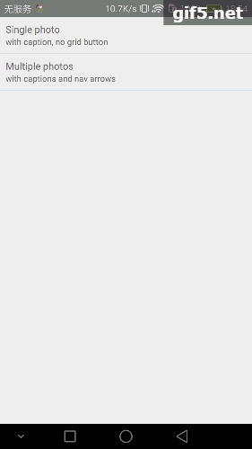

# React Native Modal Photo View

A modal image view support for react-native. This repository is fork from [halilb/react-native-photo-browser](https://github.com/halilb/react-native-photo-browser) library now and remove some functions and just left photo view.Then add and change some new functions.

The component has both iOS and Android support .

I haven't test it in IOS because i don,t have apple devices.

This repository may have a lot of issues in the beginning.



### Known issues
1、While image loading,the loading component position is not in the center of the screen.

2、Some times if image load error or failed, the error image and tip text didn't show.

3、Maybe you can touch anywhere of the screen to close modal, but you can touch the close button of the image position to close modal

### Installation 
```npm install react-native-modal-photo-view --save```

### Properties

| Prop | Type | Description | Default |
|---|---|---|---|
|**`style`**|Style|Overrides default container style.|`null`|
|**`mediaList`**|Array\<Media\>|List of [media objects](#media-object) to display.|`[]`|
|**`initialIndex`**|Number|Sets the visible photo initially.|`0`|
|**`displayCloseBtn`**|Boolean|Show close button to close modal.|`false`|
|**`displayBottomBar`**|Boolean|Whether to display the bottom text.|`true`|
|**`useCircleProgress`**_iOS_|Boolean|Displays Progress.Circle instead of default Progress.Bar for full screen photos. Check [Progress](#progress-component) section for more info.|`false`|
|**`onClose`**|Function|Function to control the modal visible or not.|`() => {}`|
|**`visible`**|Boolean|Modal visible or not.|`false`|
|**`onPhotoLongPress`**|Function|Called when a long press trigged on a photo.Plan to add in the future|`() => {}`|
|**`delayPhotoLongPress`**|Number|The long press delay in `ms`.Plan to add in the future|`1000`|
|**`imageErrorTitle`**|String|Text will show when image load error or failed.|`Load failed`|

### Media Object

```js
const media = {
  photo: '', // a remote photo or local media url
};
```


### Progress Component

#### Android

Built-in [ActivityIndicator](https://facebook.github.io/react-native/docs/activityindicator.html) component is used for Android. Any additional configuration is not needed.

#### iOS

[react-native-progress](https://github.com/oblador/react-native-progress) component is used as progress indicator. The default progress component is `Progress.Bar`. You can also use `Progress.Circle` component by simply using `useCircleProgress` prop, and adding `ReactART` library to your Xcode project. For more information please check out [react-native-progress repo](https://github.com/oblador/react-native-progress#reactart-based-components) and [React Native documentation](http://facebook.github.io/react-native/docs/linking-libraries-ios.html#content).

### Examples

Follow those steps to run the example:

1. Clone the repo `git clone https://github.com/halilb/react-native-photo-browser && cd react-native-modal-photo-view/Example`
2. Install dependencies `npm install` or `yarn`
3. Follow [official instructions](https://facebook.github.io/react-native/docs/getting-started.html) to run the example project in a simulator or device.

### Roadmap
- [x] Android support
- [ ] Improve performance for bigger collections
- [ ] Video support
- [ ] Photo zoom
- [x] Zooming photos to fill the screen

### Licence
[MIT](http://opensource.org/licenses/mit-license.html)
